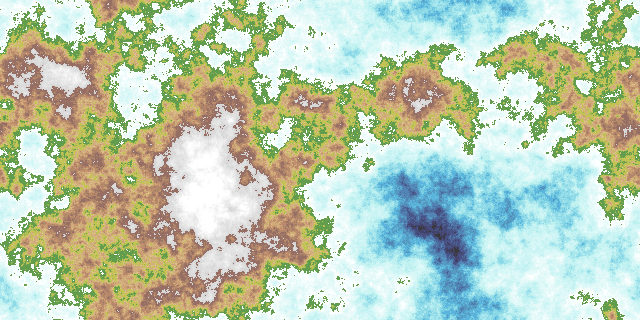

# Mappe

Mappe is the consolidation point for Michael D. Henderson's map and world
generators. The project is currently in the inventory and review phase: each
existing generator will be evaluated before code is migrated, rewritten, or
left in its original repository.



## Goals

- Preserve useful generation algorithms, tests, fixtures, and documentation.
- Make deterministic generation and reproducible output the default.
- Reduce duplicated implementations without losing distinct generator models.
- Record an explicit include-or-ignore decision for every candidate project.

## Existing projects

This inventory was surveyed on 2026-09-24 across the public repositories owned
by [`mdhender`](https://github.com/mdhender),
[`maloquacious`](https://github.com/maloquacious), and
[`playbymail`](https://github.com/playbymail).

Private repositories and projects whose primary purpose is a game
engine, map viewer/server, file converter, noise library, or grid primitive are
outside this public inventory. No public standalone map generator was found in
`playbymail`.

“Last updated” is the date of the latest commit on the repository's default
branch at the time of the survey.

| Repository | Purpose | Brief status | Last updated | Review |
| --- | --- | --- | --- | --- |
| [`maloquacious/mappe`](https://github.com/maloquacious/mappe) | Consolidated map and world generators | Destination repository; inventory phase | 2026-09-24 | — |
| [`mdhender/wgvc`](https://github.com/mdhender/wgvc) | Province-first world maps with JSON, SVG, and PNG output | Active Go implementation | 2026-09-20 | [#1](https://github.com/maloquacious/mappe/issues/1) |
| [`mdhender/wgva`](https://github.com/mdhender/wgva) | Deterministic, effectively unbounded procedural hex worlds | Partially included; terrain, climate, and biome domains migrated | 2026-09-15 | [#2](https://github.com/maloquacious/mappe/issues/2) |
| [`mdhender/wgvb`](https://github.com/mdhender/wgvb) | Deterministic, effectively unbounded procedural hex worlds | Active Rust implementation; phases 1–7 reported complete | 2026-09-14 | [#3](https://github.com/maloquacious/mappe/issues/3) |
| [`mdhender/worgen`](https://github.com/mdhender/worgen) | Star-system data based on *Architect of Worlds* | Active Go library and CLI | 2026-04-23 | [#4](https://github.com/maloquacious/mappe/issues/4) |
| [`mdhender/lutymaps`](https://github.com/mdhender/lutymaps) | Galactic maps | Dormant Go prototype with minimal documentation | 2025-04-30 | [#5](https://github.com/maloquacious/mappe/issues/5) |
| [`mdhender/aow`](https://github.com/mdhender/aow) | *Architect of Worlds* generation mechanics | Dormant Go prototype; likely overlaps `worgen` | 2024-08-09 | [#6](https://github.com/maloquacious/mappe/issues/6) |
| [`mdhender/maze`](https://github.com/mdhender/maze) | Mazes generated with Wilson's algorithm | Released Go utility at v1.0.0 | 2024-07-27 | [#7](https://github.com/maloquacious/mappe/issues/7) |
| [`mdhender/maps`](https://github.com/mdhender/maps) | Map-generation experiments | Dormant Go testbed with sparse documentation | 2024-06-26 | [#8](https://github.com/maloquacious/mappe/issues/8) |
| [`mdhender/mapgen`](https://github.com/mdhender/mapgen) | Fantasy maps exposed through a web service | Partially included; flat generator migrated | 2024-03-26 | [#9](https://github.com/maloquacious/mappe/issues/9) |
| [`mdhender/worldgen`](https://github.com/mdhender/worldgen) | World maps based on John Olsson's generator | Included; ancestral fault generator migrated as `olsson` | 2023-06-15 | [#10](https://github.com/maloquacious/mappe/issues/10) |

## Review process

The linked issue for each source project is the decision record. A review ends
with one of two outcomes:

- **Include:** identify what will move, what behavior and attribution must be
  preserved, and the follow-up migration work.
- **Ignore:** explain why the project is out of scope, redundant, or already
  superseded.

Code should not be imported until its review issue records a decision.

## Included domain models

The `domains` package includes the stable elevation, heat, moisture, climate,
and 27-value terrain vocabulary migrated from
[`mdhender/wgva`](https://github.com/mdhender/wgva). `EnvironmentalMap`
classifies normalized physical samples on a finite Cartesian, row-major grid.
It preserves elevation, heat, moisture, relief, basin, and volcanic values
beside their derived elevation band, two-axis climate, and terrain or biome.
The ordered classifier includes ocean depth, ice, volcanic, elevated, wetland,
coast, and climate-cover rules. Inland sea and lake retain their stable IDs but
are not yet produced.

The source model's signed physical values are mapped linearly onto Mappe's
normalized `[0,1]` convention: `0.5` is sea level and the neutral value for
heat, moisture, basin, and volcanic tendency. `GridTopology` independently
records east-west and north-south wrapping so neighbor-based classification is
correct at each Cartesian edge. The source hex coordinates, unbounded field
generation, rim, commands, renderers, and palettes remain intentionally
omitted. The preserved MIT notice is in `docs/licenses/wgva-MIT.txt`.

## Included generators

### `olsson`

Package `olsson` contains the deterministic spherical great-circle fault
generator migrated from [`mdhender/worldgen`](https://github.com/mdhender/worldgen).
That repository preserved and ported John Olsson's original C world-map
generator. The migration retains its equirectangular map construction while
accepting a caller-owned `math/rand/v2` source in place of process-global
randomness. `GenerateNormalizedHeightMap` returns a
`domains.NormalizedHeightMap` whose elevations are `float64` values in the
inclusive range `[0,1]`; a flat map contains only zero elevations.
`GenerateHeightField` additionally records the equirectangular topology:
east-west wrapping with distinct north and south polar boundaries. The source
commands, rendering, projections, and unrelated experimental generators remain
intentionally omitted.

```go
world, err := olsson.GenerateNormalizedHeightMap(olsson.Config{
	Source: rand.NewPCG(42, 0),
	Width:  640,
	Height: 320,
	Faults: 100,
})
```

Generate the normalized height-map data as JSON with the command-line adapter:

```sh
go run ./cmd/olsson -seed 42 > world.json
```

Print the Mappe core version with:

```sh
go run ./cmd/olsson version
```

### `internal/generators/flat`

Package `internal/generators/flat` contains the planar circular-fracture
generator migrated from
[`mdhender/mapgen`](https://github.com/mdhender/mapgen/tree/main/pkg/generators/flat).
Each iteration raises or lowers a uniformly sized circular region. Circles may
be clipped at the map edges or wrap across both axes. The package accepts a
caller-owned `math/rand/v2` source and returns a `domains.NormalizedHeightMap`;
a flat map contains only zero elevations. `GenerateHeightField` derives both
wrapping axes from the existing `Config.Wrap` value. The package remains
internal, with named pipelines providing its public integration boundary.

## Stages and pipelines

A generator stage starts with a random source and generation values such as
height and width, and produces a domain object. A renderer stage translates a
domain object into another domain object or an external format. A pipeline
arranges generator and renderer stages to create an artifact.

Height-map pipelines now carry a `domains.HeightField`, which pairs the
immutable `NormalizedHeightMap` with its `GridTopology`. Pipelines derive that
topology from generator behavior and configuration rather than accepting
duplicate wrapping flags. Existing elevation PNG renderers remain
topology-agnostic and consume the enclosed normalized height map.

Package `renderers/monochromepng` translates a `domains.NormalizedHeightMap`
into an 8-bit grayscale PNG. Elevation `0` is black, elevation `1` is white,
and intermediate elevations are rounded to the nearest grayscale value.

Package `renderers/cartographicpng` translates the same domain into an opaque
land, ocean, and ice PNG using the histogram-derived bands and discrete color
palettes preserved from `mdhender/worldgen` and John Olsson's generator. The
default configuration allocates 55 percent of pixels to ocean, 8 percent to
ice, and the remainder to land. Whole elevation bins are never split, so the
actual proportions may cross those targets at a boundary.

Package `renderers/terrainpng` translates a `domains.EnvironmentalMap` into an
opaque categorical PNG with one color per terrain value. The
`flat-terrain-png` diagnostic pipeline exercises that renderer and the full
Cartesian classifier. It derives deterministic periodic heat, moisture, basin,
volcanic, and local-relief fields around the flat generator's elevation output.
Those fields are intended to expose classification and topology behavior; they
are not a climatological model.

The named `olsson-monochrome-png` pipeline composes the `olsson` generator with
that renderer. Run it through the Cobra-based `mappe` command:

```sh
go run ./cmd/mappe olsson-monochrome-png \
  --seed 42 \
  --width 640 \
  --height 320 \
  --faults 100 \
  --output world.png
```

The named `flat-monochrome-png` pipeline composes the flat circular-fracture
generator with the same renderer. Use `--wrap` to wrap generated circles across
both map axes:

```sh
go run ./cmd/mappe flat-monochrome-png \
  --seed 42 \
  --width 640 \
  --height 320 \
  --iterations 100 \
  --wrap \
  --output flat.png
```

The named `olsson-cartographic-png` and `flat-cartographic-png` pipelines
compose their respective generators with the cartographic renderer. Override
the source defaults with `--ocean-percent` and `--ice-percent`:

```sh
go run ./cmd/mappe olsson-cartographic-png \
  --seed 42 \
  --width 640 \
  --height 320 \
  --faults 100 \
  --ocean-percent 55 \
  --ice-percent 8 \
  --output world-color.png

go run ./cmd/mappe flat-cartographic-png \
  --seed 42 \
  --width 640 \
  --height 320 \
  --iterations 10000 \
  --wrap \
  --ocean-percent 55 \
  --ice-percent 8 \
  --output flat-color.png
```

Generate the diagnostic terrain map with wrapping enabled on both axes:

```sh
go run ./cmd/mappe flat-terrain-png \
  --seed 42 \
  --width 640 \
  --height 320 \
  --iterations 10000 \
  --wrap \
  --output flat-terrain.png
```

## Development

Mappe currently requires Go 1.22.12. In an Amp orb, `.agents/setup` installs the
toolchain and downloads module dependencies. Run the repository checks with:

```sh
go test ./...
```
